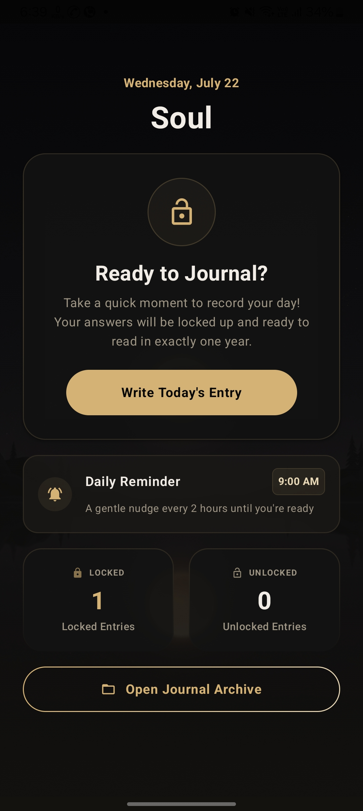

# Soul — Encrypted Year-Lock Diary

Write to your future self. Soul is an Android diary where every entry is
encrypted on-device and **time-locked for a year** — you write today, and the
entry unseals exactly one year later.

## Features

- **Year-lock** — entries are sealed after writing and can only be read one
  year later, turning the diary into a stream of messages from your past self
- **On-device encryption** — entries are encrypted at rest via a dedicated
  `CryptographyManager`; nothing readable sits in plain storage
- **Text & voice entries** — record audio memos alongside written entries,
  with in-app playback
- **Guided prompts** — daily questions to write against when the page feels
  blank
- **Daily reminders** — an `AlarmManager`-based scheduler with boot-receiver
  persistence, so reminders survive device restarts
- **Gemini integration** — AI-assisted reflection on your journaling

## Tech

Kotlin · Jetpack Compose · Room · Coroutines · AlarmManager/BroadcastReceiver

Tested with JUnit, Robolectric, and screenshot tests.

## Run Locally

**Prerequisites:** [Android Studio](https://developer.android.com/studio)

1. Open Android Studio, select **Open**, and choose this project's directory
2. Let Android Studio resolve any import incompatibilities
3. Create `.env` in the project root and add `GEMINI_API_KEY=your_key_here`
   (see `.env.example`)
4. Remove this line from `app/build.gradle.kts`:
   `signingConfig = signingConfigs.getByName("debugConfig")`
5. Run on an emulator or device
